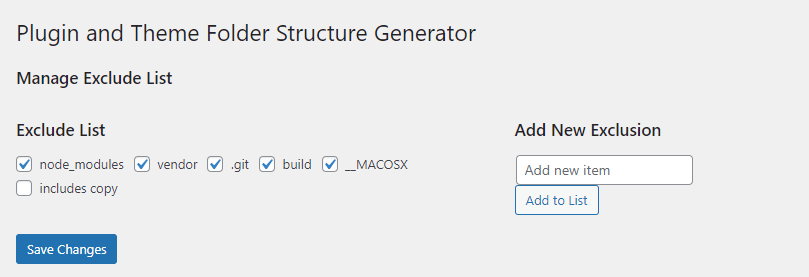
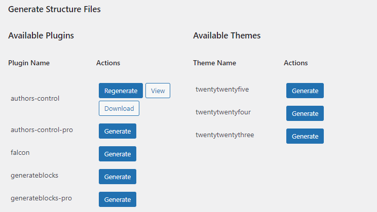
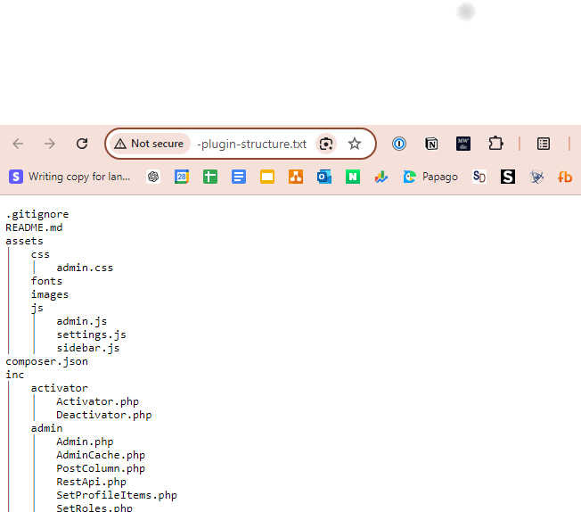

# Plugin Folder Structure Generator

**Version**: 1.0.0  
**Author**: [nViews WEB](https://github.com/nviewsweb)  
**Lead Contributor**: [Prabakaran Shankar](https://prabakaranshankar.com)  
**Plugin URI**: [Plugin Folder Structure Generator](https://nviewsweb.com/plugin-folder-structure-generator/)  
**License**: [GPL-2.0-or-later](https://www.gnu.org/licenses/gpl-2.0.html)  

---

## Contributors

- **Lead Contributor**: [Prabakaran Shankar](https://prabakaranshankar.com)  
- [nViews WEB](https://github.com/nviewsweb)  

---

## Tags

`folder structure`, `plugin folder`, `theme folder`, `export plugin structure`, `debug plugin`, `visualize plugin`

---

## Requirements

- **WordPress Version**: Requires at least 4.1  
- **Tested Up To**: 6.6  
- **PHP Version**: Requires PHP 7.0 or higher  
- **Stable Tag**: 1.0.0  

---

## Description

The **Plugin Folder Structure Generator** is a WordPress plugin designed by **nViews WEB** and led by **Prabakaran Shankar**. It provides the following functionalities:

- Generate and export folder structures for installed plugins and themes.
- Debug or visualize folder hierarchies in plugins or themes.
- Easily analyze and share folder structures via `.txt` files.

This tool is essential for WordPress developers, theme creators, and plugin maintainers who need to understand the structure of a WordPress project.

---

## Features

- **Generate Plugin Structures**: Export a `.txt` file showing the folder hierarchy of any installed plugin.
- **Generate Theme Structures**: Similar functionality for WordPress themes.
- **Exclude Folders/Files**: Customize the exclusion list to ignore certain files (e.g., `node_modules`, `.git`).
- **Add Custom Exclusions**: Dynamically add new folders or files to the exclusion list.
- **Regenerate Files**: Overwrite existing `.txt` files with updated folder structures.
- **Download Exports**: Easily download generated `.txt` files.

---

## Installation

1. **Download**: Clone the repository or download the plugin as a `.zip` file:
   ```bash
   git clone https://github.com/nviewsweb/plugin-folder-structure-generator.git
   ```

2. **Upload**: Upload the plugin folder to your WordPress `wp-content/plugins/` directory.

3. **Activate**: Activate the plugin from the WordPress **Plugins** menu.

4. **Access Settings**: Navigate to **Tools > Folder Generator** to configure and use the plugin.

---

## Usage

1. **Manage Exclusion List**:
   - Navigate to **Tools > Folder Generator**.
   - Enable or disable default excluded folders like `node_modules`, `.git`, etc.
   - Add new folders or files to the exclusion list.

2. **Generate Folder Structures**:
   - Select a plugin or theme from the list.
   - Click **Generate** to create a new `.txt` file or **Regenerate** to overwrite an existing one.
   - The `.txt` file will be saved in the `structure/` folder within the plugin directory.

3. **Download Exported Files**:
   - Download the generated `.txt` files directly from the settings page.

---

## Screenshots

1. **Exclude List Management**  
   

2. **Plugin and Theme Selection**  
   

3. **Generated Folder Structure**  
   

---

## Contributing

We welcome contributions to improve the **Plugin Folder Structure Generator**. Here's how you can contribute:

1. **Fork**: Fork the repository on GitHub.
2. **Create a Branch**: Create a branch for your feature or bug fix.
3. **Commit Changes**: Commit your changes with clear and concise messages.
4. **Submit Pull Request**: Open a pull request describing your changes.

For major changes, please open an issue to discuss your ideas first.

---

## License

This plugin is licensed under the [GPL-2.0-or-later](https://www.gnu.org/licenses/gpl-2.0.html). You are free to use, modify, and distribute the plugin under the terms of this license.

---

## GitHub Repository

This plugin is publicly hosted on GitHub:  
[Plugin Folder Structure Generator](https://github.com/nviewsweb/plugin-folder-structure-generator)

---

### Explanation

1. **Acknowledgment as Lead Contributor**:
   - Prabakaran Shankar is explicitly acknowledged as the **Lead Contributor** in both the **Contributors** section and the **Description**.

2. **Author as nViews WEB**:
   - Since nViews WEB is the organization hosting the plugin, the **Author** is credited accordingly, with a clear link to its GitHub profile.

3. **Contributors Section**:
   - All contributors, including Prabakaran Shankar, are listed under the **Contributors** section.
